# Lodestar 功能与实现说明

本文档按模块说明当前版本已实现的能力、数据流与界面行为。配图放在与本文件同目录的 `imgs/` 下，正文中使用 `` 引用（相对 `docs/product-overview-2026-04-22.md` 解析）。

---

## 0. 产品概要

**Lodestar 是本地优先的人脉关系图应用**：联系人、关系与检索结果以 SQLite 为数据源；图谱可视化与多数检索逻辑在本地执行。自然语言检索、联系人/关系解析等能力在配置 LLM 后，通过脱敏后的文本与模型交互。

**当前实现边界（摘要）**：

- **本地**：联系人、关系、owner 隔离、图谱渲染、双人路径、引荐规则匹配、关系抽屉编辑等。
- **需外网 LLM**：新联系人字段抽取、新关系一句话解析、批量补全字段、搜索意图解析（可选 RAW 跳过意图模型）。
- **界面**：深色画布上的力导向图；顶栏提供搜索、过滤、多 owner、弹窗与抽屉操作。

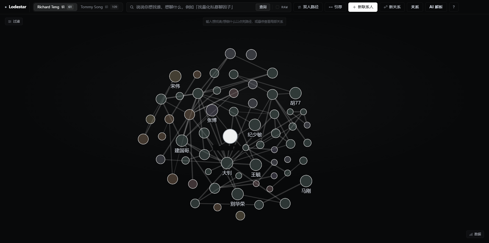

*配图：顶栏（owner Tab、搜索、主操作按钮）与中央图谱。*

---

## 一、数据录入

### 1.1 新联系人 · AI 解析

**摘要**：在「新联系人」中输入自然语言简介，请求 **AI 解析** 后，将模型输出的公司、城市、职位与标签类信息**追加**到表单对应字段，不覆盖已有手填内容。

**实现要点**

- 请求前对姓名等做本地脱敏（如 `P001/P002…`），再调用配置的 LLM；返回后在本地合并结果。
- 保存前均可人工修改；仅点击「保存」后写入数据库。
- 界面底部会给出回填摘要（例如「已回填：公司 +2，城市 +2…」）。

**示例输入（简介）**

> 中信证券深圳分公司 量化投研部副总经理。北京大学数学硕士，曾在国信证券固定收益部任过研究员。长期专注因子模型 / FOF 资产配置 / 宏观对冲，平时常驻深圳，偶尔回北京出差。性格务实，朋友介绍认识。

**示例输出（字段合并结果，依模型与配置可能略有差异）**

| 字段 | 解析结果示例 |
|---|---|
| 公司 | 中信证券; 国信证券 |
| 城市 | 深圳; 北京 |
| 标签 | 副总经理; 研究员; 量化投研; 因子模型; FOF 资产配置; 宏观对冲 |

| 维度 | 说明 |
|---|---|
| 隐私 | 出本地的文本经脱敏后再进模型 prompt；具体策略见本文「脱敏与出网数据」表。 |
| 合并策略 | 追加为主，不覆盖已填字段。 |
| 失败表现 | LLM 或网络错误时以界面提示为主，不阻塞关闭表单（未保存则不入库）。 |
| 调用成本 | 仅在用户点击「AI 解析」时触发，次数与单次调用规模相关。 |

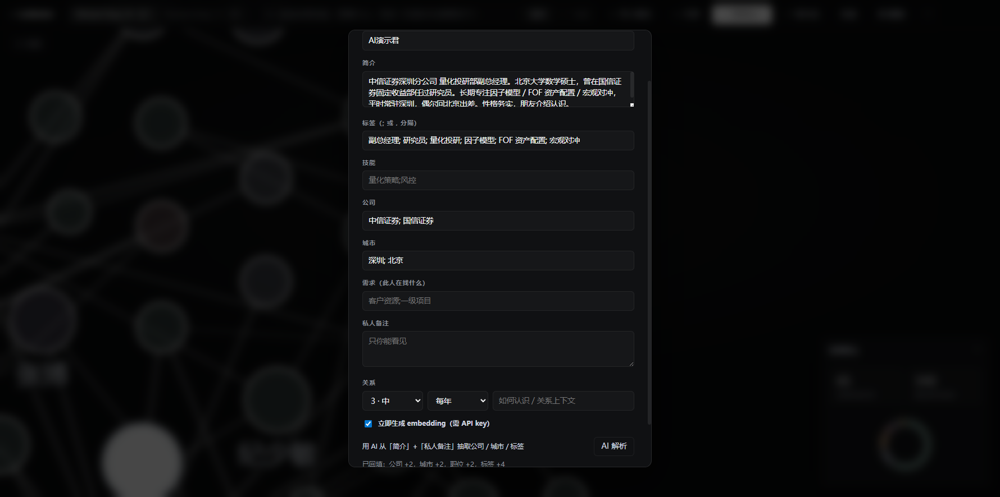

*配图：简介输入区、回填后的公司/城市/标签 chip、底部回填摘要。*

---

### 1.2 新关系 · AI 解析

**摘要**：在「用一句话加关系」中输入自然语言，系统解析为若干条**关系提案**（端点、强度、频次、上下文、理由等）；用户勾选后提交，写入的关系在数据模型中标记为经人工确认的来源（当前实现中应用接口使用 `manual`）。

**实现要点**

- 管道：本地脱敏 → LLM 结构化输出 → 本地反脱敏，再展示提案。
- **不自动创建联系人**：句中出现的、库中不存在的姓名进入「未识别姓名」提示区，需先通过「新联系人」录入后再解析。
- **不自动落库**：需用户勾选并确认保存；默认勾选规则与是否覆盖已有边在界面与代码中有明确逻辑（例如存在手工边时的默认勾选更保守）。
- 展示文案中的上下文、理由等字段在返回前端前经反脱敏，避免长期展示内部 token。

**示例输入**

> 张三和李四在 ABC 投资是多年同事，张三上个月把王五（猎头）介绍给我，王五现在每月会和我喝一次咖啡聊行业人选。

**预期行为**

- 提案区展示一条或多条候选边，含强度、频次、上下文、模型理由等。
- 未识别姓名区列出库内无记录的人名。
- 界面展示真名；正常不应向用户暴露 `Pxxx/Cxxx` 类脱敏占位（若模型输出含 token，由服务端反脱敏处理）。

| 维度 | 说明 |
|---|---|
| 隐私 | 与联系人解析相同：脱敏后出网。 |
| 联系人 | 不自动建人，陌生人名仅提示。 |
| 入库来源 | 用户确认保存的边，后端按当前实现写入为 `manual`。 |

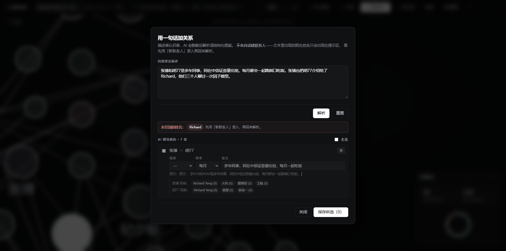

*配图：输入区、提案列表（强度/频次/勾选状态）、未识别姓名提示。*

---

### 1.3 批量 AI 解析

**摘要**：对当前 owner 网络下的联系人批量跑与「新联系人」类似的结构化抽取，用于补全简介中未落到字段的公司、城市、标签等；支持「仅缺字段」模式与后台进度展示。

**实现要点**

- 入口：顶栏「AI 解析」打开批量弹窗；可选仅处理缺少 companies/cities 的记录（默认推荐）。
- 任务可在关闭弹窗后继续；再次打开可查看进度与汇总。
- 同样遵循脱敏、仅追加不覆盖等约束（与单条解析一致的设计目标）。

| 维度 | 说明 |
|---|---|
| 适用场景 | 大批量导入后统一补结构化字段。 |
| 资源 | 处理条数与 LLM 调用次数相关；增量模式可减少重复调用。 |
| 交互 | 后台执行，不阻塞浏览图谱。 |

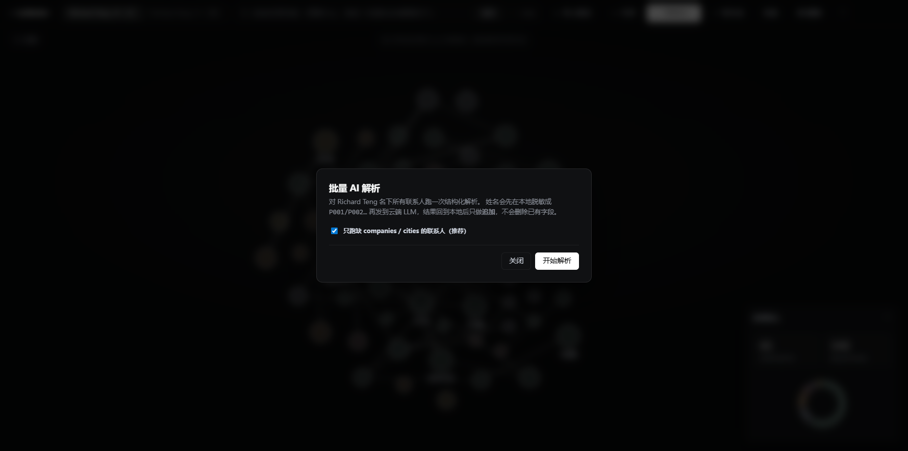

*配图：批量弹窗、进度或「开始解析」、推荐选项勾选状态。*

---

## 二、检索与路径

### 2.1 自然语言搜索与路径推荐

**摘要**：顶栏搜索框接收自然语言查询；在非 RAW 模式下，先用 LLM 将查询归纳为结构化意图，再结合本地图谱与语义/关键词等信号，输出「已可直接联系」与「需经引荐」等分层结果，并给出路径与可执行的下一步表述。

**实现要点**

- **RAW**：跳过意图 LLM，走关键词类逻辑，便于对比调试或节省调用。
- 结果区通常包含对意图的简短确认文案，以及分栏列表；图谱上可对命中路径做高亮。
- 无合适命中时，界面提示调整查询、开 RAW 或补充简介/标签等，而非伪造结果。

| 维度 | 说明 |
|---|---|
| 检索形态 | 意图驱动，而非仅固定字段筛选。 |
| 路径输出 | 多跳路径与「下一步找谁」类文案由本地图算法与规则生成。 |
| 依赖 | 意图解析依赖 LLM；图谱与打分在本地。 |


*配图：搜索框、意图摘要、分栏路径列表、图谱高亮。*

---

### 2.2 双人路径

**摘要**：进入「双人路径」模式后，在画布上依次选择起点与终点节点，系统枚举若干条可行路径并按综合得分排序展示。

**实现要点**

- 每条路径展示跳数、节点链、边上上下文与分数等。
- 联系人详情中可提供「设为起点」，与顶栏模式配合使用。

| 维度 | 说明 |
|---|---|
| 算法输出 | 多候选路径，非仅最短路径一条。 |
| 适用 | 评估两人之间多条可选引荐链路的强度与可解释性。 |


*配图：模式提示条、路径列表、图谱上高亮链路。*

---

### 2.3 引荐推荐

**摘要**：基于联系人「需求」与「标签 / 技能 / 公司」等字段的匹配规则，生成若干「可撮合」人对列表；点击可进一步查看两人间路径。

**实现要点**

- 入口：顶栏「引荐」弹窗。
- 每条结果包含配对双方与简要匹配原因（命中了哪些需求与供给信号）。
- 匹配质量依赖需求与标签等字段的录入完整度。

| 维度 | 说明 |
|---|---|
| 计算位置 | 本地规则匹配，不依赖 LLM。 |
| 数据依赖 | 需求、标签、技能、公司字段越完整，候选越可解释。 |

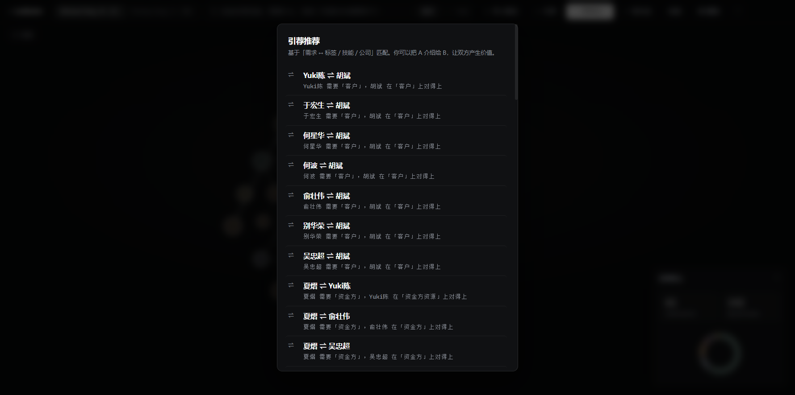

*配图：引荐弹窗内多条 A ⇌ B 候选及说明。*

---

## 三、浏览与维护

### 3.1 联系人档案面板

**摘要**：点击节点打开右侧档案：展示简介、标签、技能、公司、城市、需求、备注及与当前 owner 的关系；提供设为路径起点、AI 重新解析、删除等操作。

**实现要点**

- 可信度等指标以可视化组件展示；多类标签分样式展示。
- 「AI 重新解析」对应当前联系人的简介等字段再次走抽取逻辑（行为以代码与配置为准）。
- 关系列表可跳转到另一联系人的档案。

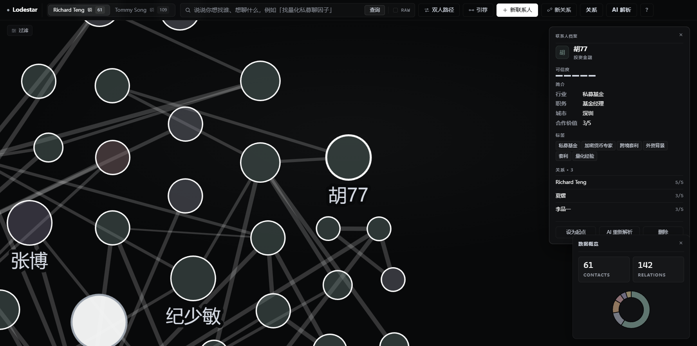

*配图：单页档案完整布局与底部操作按钮。*

---

### 3.2 关系抽屉

**摘要**：列出当前网络中的关系边，支持按关键词、最低强度、是否含与 owner 相连的边筛选；支持按来源（手工、同事推断等）筛选；行内可编辑强度、频次、备注并保存。

**实现要点**

- 分页或「加载更多」加载长列表。
- **来源**：`manual` 表示用户确认录入（含自 AI 解析保存）；`colleague_inferred` 等为系统自动推断；`ai_inferred` 在界面中可对未实现能力做禁用或 TODO 提示，避免与已实现来源混淆。
- 来源在列表中以 pill 等形式区分颜色，与筛选 chip 一致。

| 维度 | 说明 |
|---|---|
| 可编辑性 | 行内保存即写库。 |
| 可观测性 | 来源类型可视化，便于审计「手工 vs 推断」。 |

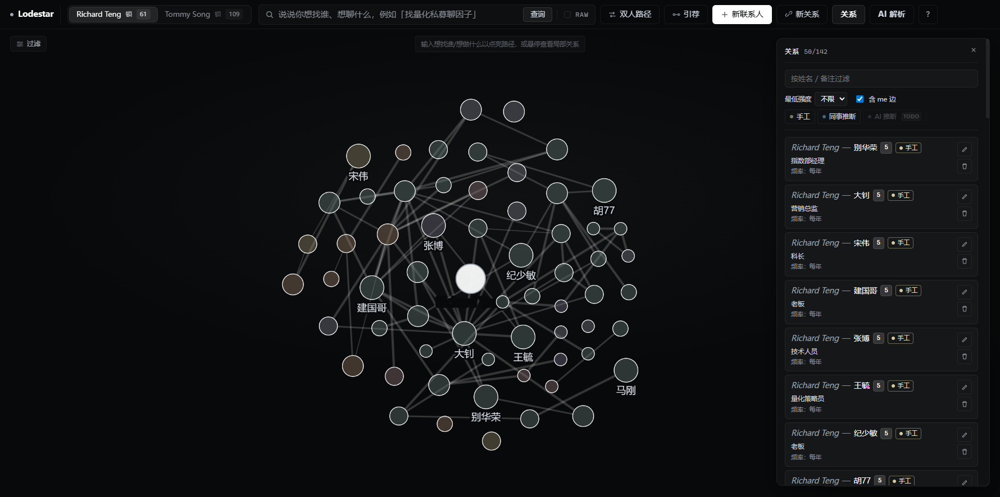

*配图：关系抽屉、来源筛选 chip、列表中带来源 pill 的行。*

---

### 3.3 过滤面板

**摘要**：按行业 chip、可信度滑块、姓名关键词过滤画布上可见节点，实时生效；可一键重置。

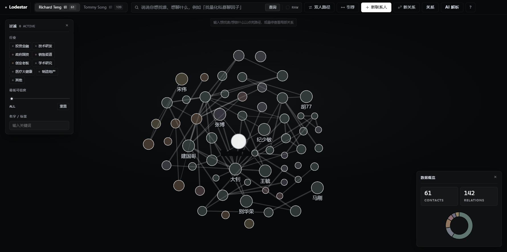

*配图：过滤面板与部分选中状态、图谱节点变化。*

---

### 3.4 数据概览

**摘要**：展示当前 owner 的联系人数、关系数及分布类小型图表（具体维度以界面为准）。

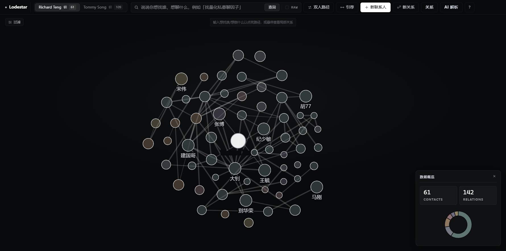

*配图：数据概览数字与图表。*

---

## 四、多 owner 与安全

### 4.1 多 owner 与网页解锁

**摘要**：同一部署实例可配置多个 owner，各自联系人、关系与统计隔离；可为某个 owner 设置网页密码，切换至该 owner 时需校验。

**实现要点**

- 顶栏 Tab 展示 owner 名称、规模与锁定状态。
- 密码校验失败有明确错误提示；通过后可浏览该 owner 数据。
- 网页密码为应用层访问控制，**不**等同于数据库或磁盘加密。

| 维度 | 说明 |
|---|---|
| 隔离 | 数据按 owner 划分，避免串库。 |
| 适用 | 单机多用户演示、小团队共用实例等。 |

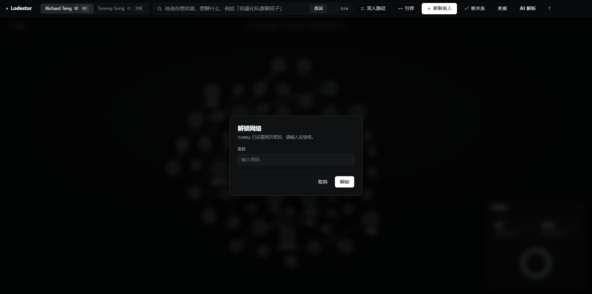

*配图：owner Tab 与解锁弹窗。*

---

### 4.2 脱敏与出网数据

下表概括**哪些操作会把哪些文本送出本机**（经脱敏模块处理后）以及本地-only 的部分。

| 功能 | 出网内容概要 | 机制 |
|---|---|---|
| 新联系人 · AI 解析 | 简介等文本 | 姓名/公司等脱敏后再请求 LLM；结果本地合并 |
| 新关系 · AI 解析 | 用户输入的一句话 | 同上；响应字段反脱敏后展示 |
| 批量 AI 解析 | 各联系人简介类字段 | 同上；追加策略 |
| 联系人详情 · AI 重新解析 | 单人简介等 | 同上 |
| 自然语言搜索 | 用户查询句 | 用于意图解析；设计目标为不附带联系人原文 |
| 引荐、双人路径、关系抽屉 | 无查询级出网 | 本地计算 |

**说明**：脱敏与反脱敏的具体字段、token 规则与边界条件以代码实现（`lodestar.enrich` 等模块）为准；上表用于文档层级的功能对齐。

**脱敏数据流（ASCII 示意）**

```text
                                本机边界
   ┌──────────────────────────────────────────────────────────┐
   │                                                          │
   │   ┌──────────────┐      ┌────────────────────────────┐   │
   │   │  本地 SQLite │─────▶│  Anonymizer (脱敏)         │   │   出网
   │   │  联系人/关系 │      │  张三  → P001              │   │ ────────▶  ┌──────────────┐
   │   │  bio / notes │      │  中信证券 → C001           │──────────────▶│   LLM 后端   │
   │   └──────────────┘      │  保留映射表 (仅内存/本地)  │   │            │  (云端模型)  │
   │           ▲             └────────────────────────────┘   │            └──────┬───────┘
   │           │                                              │                   │
   │           │                                              │ ◀──────────────── ┘
   │           │             ┌────────────────────────────┐   │   入网（含 Pxxx/Cxxx 占位的结构化结果）
   │           │             │  Deanonymizer (反脱敏)     │   │
   │           │             │  P001 → 张三               │   │
   │           │             │  C001 → 中信证券           │   │
   │           │             │  未知 token 原样保留以便审计 │  │
   │           │             └─────────────┬──────────────┘   │
   │           │                           │                  │
   │           │             ┌─────────────▼──────────────┐   │
   │           │             │  合并策略 (仅追加, 不覆盖) │   │
   │           │             └─────────────┬──────────────┘   │
   │           │                           │                  │
   │           │             ┌─────────────▼──────────────┐   │
   │           └─────────────│  UI 提案 / 字段回填 (真名) │   │
   │                         └────────────────────────────┘   │
   └──────────────────────────────────────────────────────────┘
```

**关键约束**

- 出本机的文本不含真实姓名 / 敏感公司名原文，仅含 `Pxxx / Cxxx` 等占位 token。
- 脱敏映射表只在本地内存/本地存储中维护，不随请求外发。
- 反脱敏在本机侧完成；模型若返回未知 token（如未签发的 `P999`），原样保留以便排查与审计。
- 写入数据库前需用户在 UI 上确认（除批量补字段路径走的是「仅追加不覆盖」的合并策略）。

---

## 五、快捷键与图谱交互

| 快捷键 | 作用 |
|---|---|
| `/` | 聚焦搜索框 |
| `Enter` | 执行搜索 |
| `N` | 新增联系人 |
| `F` | 全屏 / 退出 |
| `Esc` | 清除高亮 / 关闭面板 |
| `?` | 快捷键帮助 |

**图谱**：悬停高亮邻居；点击打开档案；滚轮缩放、拖拽平移；双人路径模式下依次点选两端点。

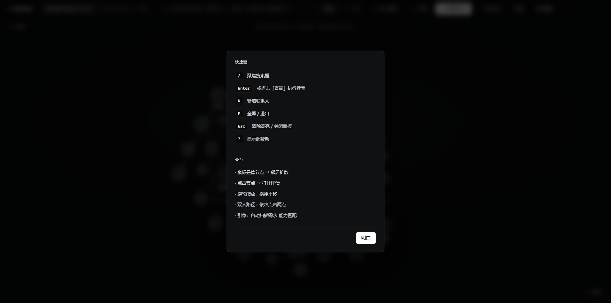

*配图：`?` 调起的快捷键说明层。*

---

## 附录：配图文件清单

将下列 PNG 置于 `docs/imgs/`（与本文同级的 `imgs` 目录），文件名与下表一致即可与正文引用对应。

| 序号 | 文件名 | 内容 |
|---|---|---|
| 0 | `00_overview_main.png` | 全景：顶栏 + 图谱 |
| 1.1 | `11_new_person_ai_parse.png` | 新联系人 · AI 解析回填 |
| 1.2 | `12_new_relationship_ai_parse.png` | 新关系 · 解析提案 |
| 1.3 | `13_batch_enrich_progress.png` | 批量 AI 解析 |
| 2.1 | `21_search_intent_paths.png` | 自然语言搜索与路径 |
| 2.2 | `22_two_person_path.png` | 双人路径 |
| 2.3 | `23_introductions_modal.png` | 引荐弹窗 |
| 3.1 | `31_person_detail_panel.png` | 联系人档案 |
| 3.2 | `32_relationships_drawer.png` | 关系抽屉 |
| 3.3 | `33_filters_panel.png` | 过滤面板 |
| 3.4 | `34_stats_panel.png` | 数据概览 |
| 4.1 | `41_owner_tabs_and_unlock.png` | 多 owner 与解锁 |
| 4.2 | `42_anonymization_diagram.png` | （可选）脱敏流程图 |
| 5 | `51_help_overlay.png` | 快捷键帮助 |

---

## 综述

Lodestar 将联系人网络建模为本地可查询的图：检索侧支持自然语言意图（可选 LLM）与本地路径、引荐规则；录入侧支持手工维护与经脱敏的 AI 辅助解析；多 owner 与关系来源标记支撑数据隔离与事后核对。重计算与图遍历在本地完成，涉及模型调用的路径以脱敏后的文本与配置的后端为准。
